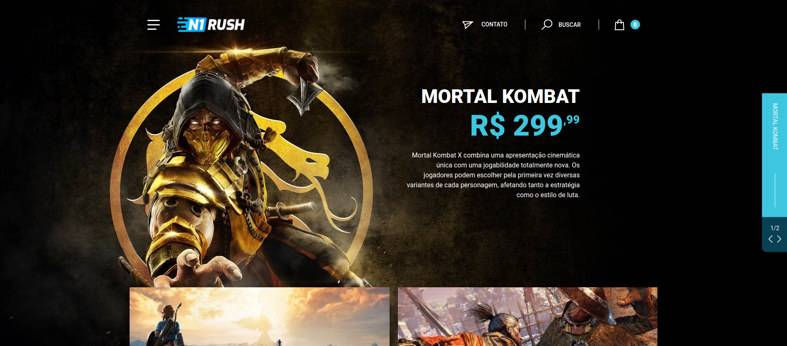

# N1 Rush

E-commerce de jogos desenvolvido para avaliação de Front-end Jr na Agência N1.

Acessar a demonstração: https://wellysonvie-n1-rush.vercel.app

  

## ⚙️ Tecnologias

- HTML5/CSS3
- Sass
- ReactJS
- Next.js

## 🚀 Como executar

- Clone o repositório
- Instale as dependências com `yarn`
- Inicie o servidor de desenvolvimento com `yarn dev`

Agora você pode acessar [`localhost:3000`](http://localhost:3000) no navegador.

---

👨‍💻 Desenvolvido por Wellyson Vieira
